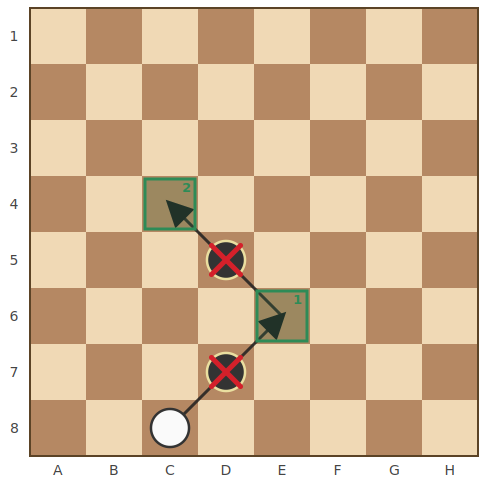
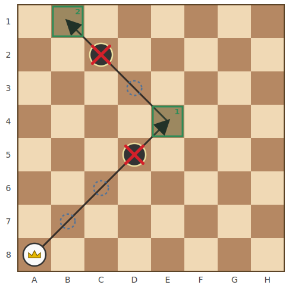

# กติกาหมากฮอสไทย (Thai Checkers Rules)

เอกสารนี้อธิบาย **กติกาการเล่น** ของหมากฮอสไทย

## สารบัญ

- [กระดานและการจัดวางเริ่มต้น](#กระดานและการจัดวางเริ่มต้น)
- [ลำดับการเดิน](#ลำดับการเดิน)
- [ชนิดของหมาก](#ชนิดของหมาก)
- [การเดิน](#การเดิน)
- [การกิน](#การกิน)
- [การเลื่อนขั้นเป็นฮอส](#การเลื่อนขั้นเป็นฮอส-promotion)
- [การจบเกม](#การจบเกม)
- [สรุปกติกาแบบย่อ](#สรุปกติกาแบบย่อ)

---

## กระดานและการจัดวางเริ่มต้น

- ใช้กระดาน **8×8** แต่เล่นเฉพาะบน **ช่องสีเข้ม 32 ช่อง** เท่านั้น (ช่องที่ผลรวมพิกัด `x + y` เป็นเลขคี่)
- พิกัดใช้แบบเดียวกับหมากรุก: คอลัมน์ **A–H** และแถว **1–8** เช่น `C4`
- แต่ละฝ่ายมีหมากฝ่ายละ **8 ตัว** (รวม 16 ตัว) เริ่มเกมเป็น **เบี้ย** ทั้งหมด
- **ฝ่ายขาวเดินก่อน** จากนั้นผลัดกันเดินทีละตา

| ฝ่าย | ตำแหน่งบนกระดาน | แถวเริ่มต้น | ช่อง |
|------|------------------|-------------|------|
| ดำ (Black) | ด้านบน | แถว 1–2 | `B1 D1 F1 H1` · `A2 C2 E2 G2` |
| ขาว (White) | ด้านล่าง | แถว 7–8 | `B7 D7 F7 H7` · `A8 C8 E8 G8` |

ทิศการเดิน: ขาวเดิน "ขึ้น" (เข้าหาแถว 1) ส่วนดำเดิน "ลง" (เข้าหาแถว 8)

---

## ลำดับการเดิน

- ในแต่ละตา ผู้เล่นเดินหมากของตัวเองได้ **เพียงตัวเดียว** (เดินหมากฝ่ายตรงข้ามไม่ได้)
- เมื่อถึงตา หากมีตาเดินที่ถูกกติกา ต้องเลือกเดินหนึ่งในนั้นเสมอ
- **ถ้ากินได้ ต้องกิน** — มีตากินอยู่แม้เพียงตาเดียวก็ห้ามเดินธรรมดา
- จะเดินธรรมดาได้ ก็ต่อเมื่อไม่มีตากินเลย

---

## ชนิดของหมาก

| ชนิด | ชื่อในโค้ด | คำอธิบาย |
|------|-----------|-----------|
| **เบี้ย** | `PION` | หมากธรรมดา เดินและกินไปข้างหน้าทีละช่อง |
| **ฮอส** | `DAME` | เบี้ยที่เลื่อนขั้นแล้ว เดินทแยงได้ไกลทุกทิศ (คล้ายโคนในหมากรุก) |

---

## การเดิน

### เบี้ย (Pion)

เบี้ยเดินทแยง **ไปข้างหน้าเท่านั้น ครั้งละ 1 ช่อง** ลงในช่องว่าง

- ขาวเดินทแยงขึ้น (เข้าหาแถว 1) ได้ทั้งซ้ายหน้าและขวาหน้า
- ดำเดินทแยงลง (เข้าหาแถว 8) ในลักษณะเดียวกัน
- เบี้ย **เดินถอยหลังไม่ได้**

> ในรูป เบี้ยขาวที่ `D5` เดินไป `C4` หรือ `E4` ได้ (จุดเขียว) แต่เดินถอยหลังไป `C6` หรือ `E6` ไม่ได้

### ฮอส (Dame)

ฮอสเดินทแยงได้ **ทั้ง 4 ทิศ** และไป **ไกลกี่ช่องก็ได้** ตราบใดที่ช่องระหว่างทางว่างทั้งหมด (เหมือนโคนหรือบิชอปในหมากรุก)

---

## การกิน

หลักของการกินมี 2 ข้อ:

1. **กินเป็นข้อบังคับ** — ถ้าหมากของฝ่ายที่ถึงตามีตากินได้ ต้องกินเท่านั้น เดินธรรมดาไม่ได้
2. **ไม่บังคับกินให้มากที่สุด** — ถ้ามีหลายทางให้กิน เลือกทางไหนก็ได้ ไม่จำเป็นต้องเลือกทางที่กินได้มากที่สุด

### เบี้ยกิน

เบี้ยกินด้วยการ **กระโดดข้าม** หมากฝ่ายตรงข้ามที่อยู่ติดกันในแนวทแยง แล้วลงช่องว่างที่อยู่ถัดไปอีก 1 ช่อง

- เบี้ยกินได้เฉพาะ **ทิศไปข้างหน้า** (ทิศเดียวกับที่มันเดิน) เท่านั้น
- ช่องที่ลงต้องว่าง และหมากที่กระโดดข้ามต้องเป็นฝ่ายตรงข้าม
- กินไม่ได้ ถ้าช่องที่จะลง **มีหมากอื่นอยู่** หรือ **อยู่นอกกระดาน**
- กินไม่ได้ ถ้าหมากในช่องที่ติดกันเป็นฝ่ายเดียวกัน

> เบี้ยขาว `D5` กระโดดข้ามหมากดำ `C4` (กากบาทแดง) ไปลงที่ `B3` (ช่องเขียว)

### ฮอสกิน (กฎ "ลงติดตัวที่กิน")

ฮอสเคลื่อนไปตามแนวทแยง ข้ามช่องว่างได้เรื่อย ๆ จนเจอหมากฝ่ายตรงข้าม **ตัวแรก** จึงกิน แล้ว **ลงในช่องว่างช่องแรกที่อยู่ถัดจากตัวที่ถูกกินทันที**

- **ลงไกลกว่านั้นไม่ได้** — ต้องลงช่องว่างช่องแรกที่ถัดจากตัวที่ถูกกินเท่านั้น
- กินไม่ได้ ถ้ามีหมาก 2 ตัวติดกันขวางอยู่ หรือเจอหมากฝ่ายเดียวกันขวาง
- ฮอส **ข้ามช่องว่างได้** แต่ **ข้ามหมากฝ่ายตัวเองไม่ได้**

> ฮอสขาว `B1` เคลื่อนข้ามช่องว่าง `C2` (วงประน้ำเงิน) ไปกินหมากดำ `D3` แล้ว **ต้อง** ลงที่ `E4` ซึ่งเป็นช่องติดกันถัดจาก `D3`

### กินหลายต่อ (กินต่อเนื่อง · Multi-capture)

หลังกินแล้ว ถ้าหมากตัวเดิมยังกินต่อได้ **ต้องกินต่อจนสุด** โดยหักเลี้ยวเปลี่ยนทิศได้ และหยุดกลางคันไม่ได้

- หมากที่ถูกกินจะ **ถูกเก็บออกจากกระดานทันที** ในแต่ละจังหวะ จึงทำให้:
  - ไม่กินหมากตัวเดิมซ้ำสองครั้ง (ตัวที่ถูกกินไปแล้วมองไม่เห็นอีก กระโดดข้ามซ้ำไม่ได้)
  - สายการกินที่ยาวอาจไปจบบนช่องที่ตอนเริ่มมีหมากอยู่ เพราะหมากนั้นถูกเก็บออกไปแล้ว เช่น ฮอสที่กินวนกลับมาจบที่ช่องเริ่มต้น

> ฮอสขาว `C2` กิน `D3` ลง `E4` (จุด 1) แล้วหักเลี้ยวกิน `D5` ลง `C6` (จุด 2) — กิน 2 ตัวในตาเดียว

### เบี้ยกินหลายต่อ

เบี้ยก็กินหลายต่อได้เช่นกัน แต่ทุกต่อยังอยู่ภายใต้ **กติกาของเบี้ย** ล้วน ๆ คือ:

- กิน **ไปข้างหน้าทีละ 1 ช่อง** เท่านั้น — แม้อยู่ระหว่างสายการกิน ก็ **กินถอยหลังไม่ได้** (ต่างจากฮอสที่กินได้ทุกทิศและร่อนไกลได้)
- หักเลี้ยวสลับระหว่างทแยงหน้า-ซ้ายกับหน้า-ขวาได้ แต่ต้องเป็นทิศไปข้างหน้าเสมอ
- ถ้าเบี้ยไปถึง **แถวสุดท้าย** กลางสายการกิน จะ **เลื่อนขั้นเป็นฮอสแล้วจบตาทันที** ไม่กินต่อในตานั้น (ดู [การเลื่อนขั้นเป็นฮอส](#การเลื่อนขั้นเป็นฮอส-promotion))

> เบี้ยขาว `C8` กินหมากดำ `D7` ลง `E6` (จุด 1) แล้วหักเลี้ยวกินหมากดำ `D5` ลง `C4` (จุด 2) — กิน 2 ตัวในตาเดียว โดยทุกต่อยังเป็นการกินไปข้างหน้าทีละช่อง

### ฮอสกินหลายต่อแบบบินไกล

จุดเด่นของฮอสคือ **ทุกต่อของการกินหลายต่อ ฮอสจะร่อนข้ามช่องว่างไปได้ไม่จำกัดระยะ** ก่อนถึงหมากที่จะกิน ไม่ใช่เฉพาะต่อแรก — หลังจากลงจอดแล้วกินต่อ ก็ยังร่อนไกลได้อีกในต่อถัดไปเช่นกัน

ฮอสจะทำซ้ำแบบนี้ไปเรื่อย ๆ — **กิน → ลงจอด → มองหาตัวที่กินได้จากช่องที่ลงจอด** — กี่ต่อก็ได้ ไม่จำกัดจำนวน และ **สายการกินจะจบก็ต่อเมื่อจากช่องที่ลงจอดล่าสุดไม่มีหมากให้กินอีกในทุกทิศ**

ข้อควรระวัง 2 ข้อ:

- **"ไม่จำกัดระยะ" คือระยะ "ก่อนถึง" ตัวที่จะกิน** (ช่องว่างที่ร่อนข้ามไปหาเหยื่อ) แต่ **จุดที่ลงจอดยังต้องเป็นช่องว่างช่องแรกถัดจากตัวที่ถูกกินเสมอ** — กฎ "ลงติดตัวที่กิน" มีผลกับการกินทุกต่อ เลือกลงไกลกว่านั้นไม่ได้
- **แต่ละต่อหักเลี้ยวเปลี่ยนทิศได้** ต่อถัดไปไม่จำเป็นต้องไปต่อในแนวทแยงเดิม

> ฮอสขาว `A8` ร่อนข้ามช่องว่าง `B7`, `C6` (วงประน้ำเงิน) ไปกินหมากดำ `D5` แล้วลงที่ `E4` (จุด 1) จากนั้น **หักเลี้ยว** ร่อนข้าม `D3` ไปกินหมากดำ `C2` แล้วลงที่ `B1` (จุด 2) — กิน 2 ตัวในตาเดียว โดยต่อแรกเป็นการบินไกลข้ามช่องว่าง 2 ช่อง แต่ทั้งสองต่อก็ยังลงจอดติดกับตัวที่กินเสมอ

---

## การเลื่อนขั้นเป็นฮอส (Promotion)

เบี้ยที่เดินหรือกินไปถึง **แถวสุดท้ายของฝ่ายตรงข้าม** จะเลื่อนขั้นเป็น **ฮอส** ทันที

- ขาวเลื่อนขั้นเมื่อถึง **แถว 1**
- ดำเลื่อนขั้นเมื่อถึง **แถว 8**
- ถ้าเบี้ยเลื่อนขั้น **ระหว่างการกินหลายต่อ** สายการกินจะ **จบทันที** ที่ช่องเลื่อนขั้น (ไม่กินต่อในตานั้น แม้จะยังมีตัวให้กิน)

> เบี้ยขาว `C2` เดินถึงแถว 1 ที่ `B1` แล้วกลายเป็นฮอส (มงกุฎ)

---

## การจบเกม

ฝ่ายที่ **ถึงตาเดินแต่ไม่เหลือตาเดินที่ถูกกติกา** (ไม่มีทั้งทางเดินและทางกิน) จะเป็นฝ่าย **แพ้**

ในเอนจิน สถานะนี้ตรงกับ `game.moveCount() === 0`

---

## สรุปกติกาแบบย่อ

| หัวข้อ | เบี้ย (Pion) | ฮอส (Dame) |
|--------|--------------|-------------|
| ทิศการเดิน | ทแยงไปข้างหน้าเท่านั้น | ทแยงทุกทิศ |
| ระยะการเดิน | 1 ช่อง | ไกลเท่าใดก็ได้ (ช่องระหว่างทางต้องว่าง) |
| ทิศการกิน | ทแยงไปข้างหน้าเท่านั้น | ทแยงทุกทิศ |
| ช่องที่ลงหลังกิน | ถัดจากตัวที่กิน 1 ช่อง | ช่องว่างช่องแรกถัดจากตัวที่กินเท่านั้น |
| กินหลายต่อ | ได้ (บังคับกินจนสุด) | ได้ (บังคับกินจนสุด) |

- ขาวเดินก่อน · กินเป็นข้อบังคับ · ไม่บังคับกินให้มากที่สุด
- หมากที่ถูกกินจะถูกเก็บออกทันทีระหว่างสายการกิน

> การแสดงผลบนเทอร์มินัล (`cli/`) ใช้สัญลักษณ์: `●`/`■` = ฝ่ายขาว, `○`/`□` = ฝ่ายดำ
> (วงกลม = เบี้ย, สี่เหลี่ยม = ฮอส)
