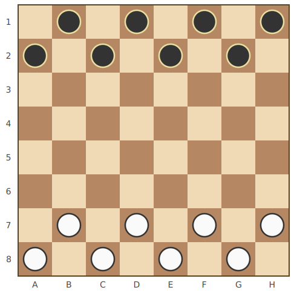
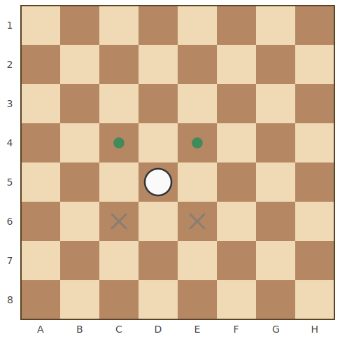
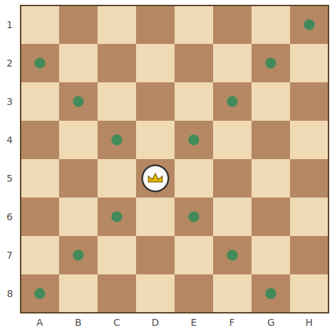
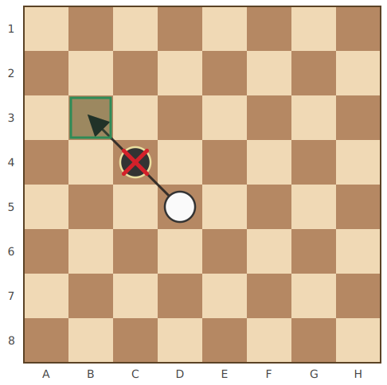
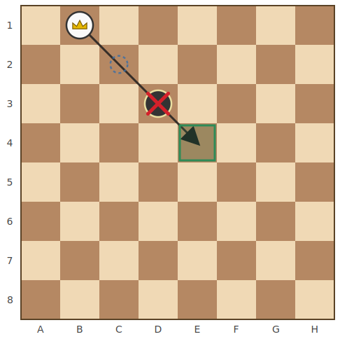
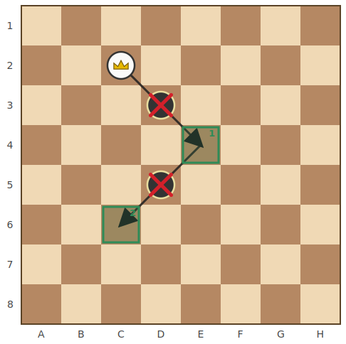
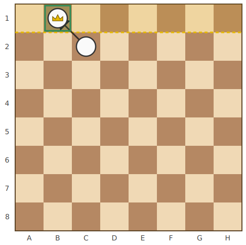

# กติกาหมากฮอสไทย (Thai Checkers Rules)

เอกสารนี้อธิบาย **กติกาการเล่น** ตามที่ถูก implement จริงในโค้ดส่วน [`core/`](../core/)

> หมายเหตุ: กติกาในเอกสารนี้สะท้อนพฤติกรรมจริงของเอนจินที่ implement ไว้ในโค้ด

## สารบัญ

- [กระดานและการจัดวางเริ่มต้น](#กระดานและการจัดวางเริ่มต้น)
- [ลำดับการเดิน](#ลำดับการเดิน)
- [ชนิดของหมาก](#ชนิดของหมาก)
- [การเดิน](#การเดิน)
- [การกิน](#การกิน)
- [การเลื่อนขั้นเป็นฮอส](#การเลื่อนขั้นเป็นฮอส-promotion)
- [การจบเกม](#การจบเกม)
- [สรุปกติกาแบบย่อ](#สรุปกติกาแบบย่อ)

---

## กระดานและการจัดวางเริ่มต้น

- กระดานขนาด **8×8** เล่นบน **ช่องสีเข้ม 32 ช่อง** เท่านั้น (ช่องที่ผลรวมพิกัด `x + y` เป็นเลขคี่)
- พิกัดใช้แบบหมากรุก: คอลัมน์ **A–H** และแถว **1–8** เช่น `C4`
- แต่ละฝ่ายมีหมาก **8 ตัว** (รวม 16 ตัว) เริ่มต้นเป็น **เบี้ย** ทั้งหมด
- **ฝ่ายขาวเดินก่อน** แล้วผลัดกันเดินทีละตา

| ฝ่าย | สี | แถวเริ่มต้น | ตำแหน่ง |
|------|-----|-------------|----------|
| ดำ (Black) | แถวบน | แถว 1–2 | `B1 D1 F1 H1` · `A2 C2 E2 G2` |
| ขาว (White) | แถวล่าง | แถว 7–8 | `B7 D7 F7 H7` · `A8 C8 E8 G8` |

ฝ่ายขาวเดิน "ขึ้น" (เข้าหาแถว 1) ฝ่ายดำเดิน "ลง" (เข้าหาแถว 8)

---

## ลำดับการเดิน

- ในแต่ละตา **ผู้เล่นสามารถเดินหมากของตัวเองตัวเดียวเท่านั้น** (หมากฝ่ายตรงข้ามเดินไม่ได้)
- ถ้าหมากของผู้เล่นที่ถึงตามี **ตาเดินที่ถูกกติกาอยู่** จะต้องเลือกหนึ่งในนั้น
- ถ้ามีตากินได้แม้แต่ตาเดียว **ต้องกิน** — ห้ามเดินธรรมดาเฉย ๆ
- ถ้าไม่มีตากิน จึงจะเดินธรรมดาได้

---

## ชนิดของหมาก

| ชนิด | ชื่อในโค้ด | คำอธิบาย |
|------|-----------|-----------|
| **เบี้ย** | `PION` | หมากธรรมดา เดิน/กินไปข้างหน้าทีละช่อง |
| **ฮอส** | `DAME` | หมากที่เลื่อนขั้นแล้ว เดินทแยงได้ไกลทุกทิศ (คล้ายโคนในหมากรุก) |

---

## การเดิน

### เบี้ย (Pion)

เบี้ยเดินทแยง **ไปข้างหน้าเท่านั้น ครั้งละ 1 ช่อง** ไปยังช่องว่าง

- ขาวเดินทแยงขึ้น (เข้าหาแถว 1) — ไปทางซ้ายหน้าหรือขวาหน้า
- ดำเดินทแยงลง (เข้าหาแถว 8)
- เบี้ย **เดินถอยหลังไม่ได้**

> ในรูป เบี้ยขาวที่ `D5` เดินไป `C4` หรือ `E4` ได้ (จุดเขียว) แต่ไปข้างหลัง (`C6`, `E6`) ไม่ได้

### ฮอส (Dame)

ฮอสเดินทแยงได้ **ทั้ง 4 ทิศ** และไป **ไกลกี่ช่องก็ได้** ตราบใดที่ช่องระหว่างทางว่างทั้งหมด (เหมือนโคน/บิชอปในหมากรุก)

---

## การกิน

กฎพื้นฐานของการกิน 2 ข้อ:

1. **กินเป็นข้อบังคับ** — ถ้าในตานั้นมีหมากของฝ่ายที่ถึงตาเดินสามารถกินได้ จะ **ต้องกิน** เท่านั้น เดินเฉย ๆ ไม่ได้
2. **ไม่บังคับให้กินมากที่สุด** — ถ้ามีหลายทางให้กิน เลือกทางไหนก็ได้ ไม่จำเป็นต้องเลือกทางที่กินได้จำนวนมากที่สุด

### เบี้ยกิน

เบี้ยกินโดย **กระโดดข้าม** หมากฝ่ายตรงข้ามที่อยู่ติดในแนวทแยง แล้วลงช่องว่างที่อยู่ถัดไปอีก 1 ช่อง

- เบี้ยกินได้เฉพาะ **ทิศไปข้างหน้า** (ทิศเดียวกับที่มันเดิน) เท่านั้น
- ช่องที่ลงต้องว่าง และหมากที่ข้ามต้องเป็นฝ่ายตรงข้าม
- ถ้าช่องลงถัดไป **ถูกหมากอื่นยึดอยู่** หรือ **อยู่นอกกระดาน** จะกินไม่ได้
- ถ้าหมากในช่องติดกันเป็นหมากฝ่ายเดียวกัน จะกินทิศนั้นไม่ได้

> เบี้ยขาว `D5` กระโดดข้ามหมากดำ `C4` (กากบาทแดง) ไปลงที่ `B3` (ช่องเขียว)

### ฮอสกิน (กฎ "ลงติดตัวที่กิน")

ฮอสบินไปตามแนวทแยง ข้ามช่องว่างได้เรื่อย ๆ จนเจอหมากฝ่ายตรงข้าม **ตัวแรก** แล้วกิน
จากนั้น **ลงช่องว่างช่องแรกที่อยู่ถัดจากตัวที่ถูกกินทันที**

- **ลงไกลกว่านั้นไม่ได้** — ฮอสต้องลงช่องว่างช่องแรกที่อยู่ถัดจากตัวที่ถูกกินเท่านั้น
- ถ้ามีหมาก 2 ตัวติดกัน หรือเจอหมากฝ่ายเดียวกันขวาง จะกินทิศนั้นไม่ได้
- ฮอส **ข้ามช่องว่างได้** แต่ **ข้ามหมากฝ่ายตัวเองไม่ได้**

> ฮอสขาว `B1` บินข้ามช่องว่าง `C2` (วงประน้ำเงิน) ไปกินหมากดำ `D3` แล้ว **ต้อง** ลงที่ `E4` ซึ่งเป็นช่องติดกันถัดจาก `D3`

### กินต่อเนื่อง (Multi-capture)

หลังกินแล้ว ถ้าหมากตัวเดิมยังกินต่อได้ **ต้องกินต่อไปจนสุด** (หักเลี้ยวเปลี่ยนทิศได้ และจะหยุดกลางคันไม่ได้)

- หมากที่ถูกกินจะถูก **เก็บออกจากกระดานทันที** ในแต่ละจังหวะ ทำให้:
  - ไม่กินหมากตัวเดิมซ้ำสองครั้ง
  - สายการกินที่ยาว อาจไปจบบนช่องที่ตอนเริ่มต้นมีหมากอยู่ (เพราะหมากนั้นถูกเก็บไปแล้ว) เช่น ฮอสที่กินวนกลับมาจบที่ช่องเริ่มต้น
- ระหว่างกินต่อเนื่อง หมากที่เพิ่งถูกกินไปแล้วจะมองไม่เห็นอีก จึงกระโดดข้ามซ้ำไม่ได้

> ฮอสขาว `C2` กิน `D3` ลง `E4` (จุด 1) แล้วหักเลี้ยวกิน `D5` ลง `C6` (จุด 2) — กิน 2 ตัวในตาเดียว

---

## การเลื่อนขั้นเป็นฮอส (Promotion)

เบี้ยที่เดินหรือกินไปถึง **แถวสุดท้ายของฝ่ายตรงข้าม** จะเลื่อนขั้นเป็น **ฮอส** ทันที

- ขาวเลื่อนขั้นเมื่อถึง **แถว 1**
- ดำเลื่อนขั้นเมื่อถึง **แถว 8**
- ถ้าเบี้ยเลื่อนขั้น **ระหว่างการกินต่อเนื่อง** สายการกินจะ **จบทันที** ที่ช่องเลื่อนขั้น (ไม่กินต่อในตานั้นแม้จะมีตัวให้กิน)

> เบี้ยขาว `C2` เดินถึงแถว 1 ที่ `B1` แล้วกลายเป็นฮอส (มงกุฎ)

---

## การจบเกม

ฝ่ายที่ **ถึงตาเดินแต่ไม่มีตาเดินที่ถูกกติกาเหลืออยู่** (ไม่มีทั้งทางเดินและทางกิน) จะเป็นฝ่าย **แพ้**
ในเอนจิน สถานะนี้คือ `game.moveCount() === 0`

---

## สรุปกติกาแบบย่อ

| หัวข้อ | เบี้ย (Pion) | ฮอส (Dame) |
|--------|--------------|-------------|
| ทิศการเดิน | ทแยงไปหน้าเท่านั้น | ทแยงทุกทิศ |
| ระยะการเดิน | 1 ช่อง | ไกลเท่าไรก็ได้ (ช่องต้องว่าง) |
| ทิศการกิน | ทแยงไปข้างหน้าเท่านั้น | ทแยงทุกทิศ |
| ช่องที่ลงหลังกิน | ถัดจากตัวที่กิน 1 ช่อง | ช่องแรกถัดจากตัวที่กินเท่านั้น |
| กินต่อเนื่อง | ได้ (บังคับกินจนสุด) | ได้ (บังคับกินจนสุด) |

- ขาวเดินก่อน · กินเป็นข้อบังคับ · ไม่บังคับกินมากที่สุด
- หมากที่ถูกกินถูกเก็บออกทันทีระหว่างสายการกิน

> การแสดงผลบนเทอร์มินัล (`cli/`) ใช้สัญลักษณ์: `●`/`■` = ฝ่ายขาว, `○`/`□` = ฝ่ายดำ
> (วงกลม = เบี้ย, สี่เหลี่ยม = ฮอส)
